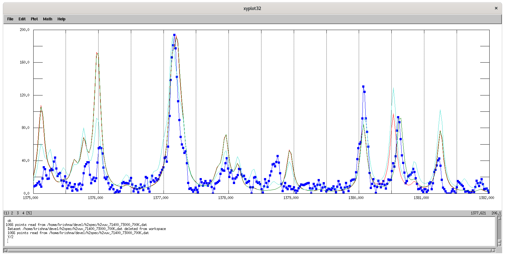

# H2SPEC
Compute the spectral line list and spectrum of H2 in the
vacuum ultraviolet region.

<h3>Description</h3>

The program <tt>h2spec</tt> computes a list of allowed optical
transitions for the Lyman (<i>B&rarr;X</i>) and Werner (<i>C&rarr;X</i>)
bands of the hydrogen molecule, using available experimental and 
theoretical data. The generated line list is written to the file,
<tt>h2lines.dat</tt>. <tt>h2spec</tt> also uses the line 
list to compute the vacuum ultraviolet spectrum of the H2 
molecule, under specified excitation conditions and spectral 
resolution. The spectrum is written to the file, <tt>h2vuv.dat</tt>.

<tt>h2spec</tt> was used in the research reported in References
1--4. Input data sources for <tt>h2spec</tt> are described in Appendix
I and Appendix II of [5] -- this information is also provided below.

<h3>Build</h3>

Under Linux, gfortran may be used to build <tt>h2spec</tt>
from source: 

	$ gfortran -o h2spec h2spec.f
 

<h3>Energy Levels and Transition Oscillator Strengths</h3>

Energy levels for the <i>X</i>, <i>B</i>, and <i>C</i> electronic
states of H2 were obtained from the following sources.

<h4><i>X</i> Levels</h4>

Energy levels for the <i>X</i> ground electronic state are
found in <tt>xlevels.dat</tt>. Herzberg and Howe [6] list the 
<i>X</i>, <i>v</i> = 0--14, <i>J</i> = 0 levels. Energies 
of higher <i>J</i> levels were computed with the expression,  
<i>E(v,J)</i> = <i>G0(v) + BvJ(J+1) -
DvJ2(J+1)2 +
HvJ3(J+1)3</i>
  
where <i>G0(v)</i> is the energy of the <i>v, J</i>=0
level, and <i>Bv</i>, <i>Dv</i>, and
<i>Hv</i> are constants given in [6].

Recent high-precision theoretical calculations of the <i>X</i>
state ro-vibronic level energies are described in [10--11]. An
alternative energy level file for the <i>X</i> state, based on
the calculations of <tt>H2SPECTRE</tt>[10--11] is provided in
<tt>xlevels-h2spectre.dat</tt>.

<h4><i>B</i> Levels</h4>

Energy levels for the <i>B</i> electronic state are found in
<tt>blevels.dat</tt>. <i>G0(v)</i> values for 
<i>v</i>=0 to <i>v</i>=5 were taken from Herzberg and Howe[6]. 
However, values for <i>v</i>=6 to <i>v</i>=13 were obtained from 
their wavelength tables for transitions arising from the given 
<i>v</i> state and the energy levels obtained for the ground state. 
For <i>J</i> &gt; 0, the energy levels were taken from 
Crosswhite[7]. A shift of 8.04 cm-1 had to be added to 
the <i>B</i> state energy levels from Crosswhite in order to make 
them consistent with the wavelength measurements of Herzberg and 
Howe[6]. The <i>v</i>=14, <i>J</i>=0 and <i>v</i>=15, <i>J</i>=0 
levels were taken from Monfils[8].

<h4><i>C</i> Levels</h4>

Energy levels for the <i>C</i> state in <tt>clevels.dat</tt>
were taken from Crosswhite [7]. Again, a shift of 
8.04 cm-1 was added to the levels reported in this 
source to place them on a consistent scale with the lower levels.

<h4>Oscillator Strengths for <i>B</i>&rarr;<i>X</i> and
<i>C</i>&rarr;<i>X</i> Transitions</h4>

The band oscillator strengths in <tt>xbf.dat</tt> and 
<tt>xcf.dat</tt> are reproduced from Allison and Dalgarno [9].
The oscillator strength for an individual rotation-vibration
transition is related to the band oscillator strength by  
<i>fv'v''J'J''</i> = 
<i>LJ'J''fv'v''</i> 
(2<i>J''</i> + 1)-1,
  
where <i>LJ'J''</i> is the H&ouml;nl-London factor. The
double-primed quantities refer to the lower level, and the
single-primed quantities refer to the upper level.

<h3>References</h3>

1. K. Myneni and J. Kielkopf, <i>Excited-state populations of</i> 
H2 <i>in the positive column of a glow discharge</i>, 
J. Phys. B <b>21</b>, 2871--2878 (1988). 
2. J. Kielkopf, K. Myneni, and F. Tomkins, <i>Unusual fluorescence
from</i> H2 <i>excited by multiphoton processes</i>,
J. Phys. B <b>23</b>, 251--261 (1990). 
3. J. F. Kielkopf and N. F. Allard, <i>Satellites on Lyman alpha
due to</i> H-H <i>and</i> H-H+ <i>collisions</i>,
Astrophysical Journal <b>450</b>:L75--L78 (1995). 
4. J. F. Kielkopf and N. F. Allard, <i>Observation of the far wing
of Lyman &alpha; due to neutral atom and ion collisions in a
laser-produced plasma</i>, Phys. Rev. A <b>58</b>, 4416--4425
(1998). 
5. K. Myneni, <i>Excited State Populations of</i> H2
<i> in a Glow Discharge</i>, M.S. Thesis, Dept. of Physics,
University of Louisville, 1987. 
6. G. Herzberg and L. L. Howe, <i>The Lyman Bands of Molecular 
Hydrogen</i>, Can. J. Phys. <b>37</b>, 636--659 (1959). 
7. H. M. Crosswhite, <i>The hydrogen molecule wavelength tables
of Gerhard Heinrich Dieke</i>, (New York: Wiley-Interscience),
1972. 
8. A. Monfils, <i>Absorption spectra of molecules</i> 
H2, HD, and D2: <i>VII. Vibrational 
constants of the B, B', B'', C, D, D', and D'' states</i>, 
J. Molec. Spec. <b>25</b>, 513--543 (1968). 
9. A. C. Allison and A. Dalgarno, <i>Band oscillator strengths
and transition probabilities for the Lyman and Werner systems of</i>
H2, HD, and D2, Atomic Data <b>1</b>, 
289--304 (1969). 
10. J. Komasa, M. Puchalski, P. Czachorowski, G. Lach, and
K. Pachucki, <i>Rovibrational energy levels of the hydrogen
molecule through nonadiabatic perturbation theory</i>, Phys.
Rev. A <b>100</b>, 032519 (2019). 
11. J. Komasa, M. Puchalski, P. Czachorowski, G. Lach, and
K. Pachucki, <tt>H2SPECTRE</tt> developer's version (28.05.2020),
https://www.fuw.edu.pl/~krp/ (2020). 

